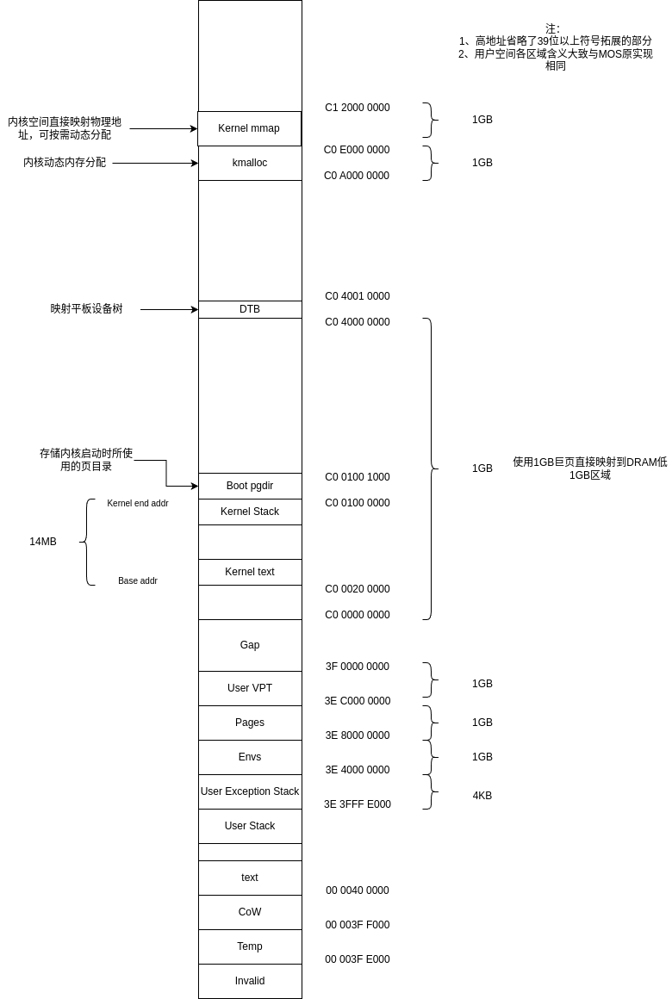

# 北航操作系统课程 挑战性任务：RISC-V 移植

本项目基于 MulanPSL-2.0 许可证的原始代码开发，包含以下两部分：

- 原始代码：仍遵循 MulanPSL-2.0（见 LICENSE-MulanPSL2），MOS 内核实验[原仓库](https://github.com/buaa-os/mos.public)
- 修改/新增部分：采用 AGPL-3.0（见 LICENSE-AGPL3）

目标平台：RISCV64

任务要求：

- 内核启动
- 内存管理
- 异常和中断处理
- 进程与调度
- 系统调用
- fork 与 IPC

完成的“可选项”任务：

- 实现字符设备驱动
- 设备树解析
- mem 函数优化
- 移动内核至高地址
- 简易 kmalloc

完成的其它自行设计的任务：

- PLIC 设备驱动
- 用户态“中断”处理
- 进程列表
- VirtIO Block 设备驱动
- Backtrace 与崩溃信息优化

计划之后完成的任务：

- 从设备树中获取内存大小
- 移植用户态 FS
- 移植 EncryptFS（Lab 5 Extra）[仓库地址](https://github.com/ap0stader/BUAA_OS/tree/lab5-encryptfs-public)
- 修复 MOS 原实现的已知问题（见“已知问题”）

## 任务要求实现

### 内核启动

#### kernel.lds：内核链接脚本

各段简介（每项开头处的数字范围表示对应文件中的行数）：

- (22 - 24)：`.text.boot`，内核初始启动代码，在低地址（`0x80200000`）运行
- (26 - 30)：`.text`，内核代码，在高地址（`0xFFFFFFC000200000`）运行
- (34 - 36)：`.text.exc_gen_entry`，异常处理入口代码，对齐 4 字节，RISCV64 中无需加载到特定位置
- (40 - 44)：`.data`，数据段
- (46 - 57)：`.bss`，BSS 段
- (59 - 65)：`.super_info`，内核符号表与字符串表的信息，详见“Backtrace 与崩溃信息优化”
- (67 - 74)：`.load_symtab`，内核符号表，该段内容与`.symtab`相同，但**会被加载到内存**，详见“Backtrace 与崩溃信息优化”
- (76 - 83)：`.load_strtab`，内核字符串表，该段内容与`.strtab`相同，但**会被加载到内存**，详见“Backtrace 与崩溃信息优化”
- (85 - 91)：`.user_buffer`，用于与用户空间交换信息的内核空间缓冲区

#### init/start.S：内核启动代码

在`init/start.S`中，实现了如下功能（每项开头处的数字范围表示对应文件中的行数）：

- (19 - 20)：保存 OpenSBI 提供的启动参数（`a0`，`a1`）
- (23)：设置分页前使用的内核临时栈的地址（低地址，`0x81000000`）
- (27)：启用分页，含内核恒等映射、移动内核到高地址（`0xFFFFFFC000000000`），详见“内存管理（含移动内核到高地址）”
- (30)：由临时栈切换到使用内核栈（高地址，`0xFFFFFFC001000000`）
- (31)：移除低地址的恒等映射，内核完全运行在高地址
- (40 - 49)：清除 BSS 段
- (56 - 59)：恢复 OpenSBI 提供的启动参数，并跳转到 C 代码（`riscv64_init`）

#### SBI 系统调用

SBI 调用遵循`SBI v0.2`规范，未使用旧版（`Legacy Extensions`）ABI 与接口。

在`include/sbi.h`中：

- (6 - 44)：定义 SBI 调用函数、SBI 返回值。
- (48 - 71)：调试控制台拓展（`Debug Console Extension`），用于输出字符
- (75 - 87)：系统复位拓展（`System Reset Extension`），用于实现关机与复位
- (91 - 98)：时钟拓展（`Timer Extension`），用于实现设置时钟中断

#### 字符输出

复用了 MOS 中实现的`vprintfmt`、`printk`等函数，将`outputk`函数实现为调用 SBI 输出到调试控制台（`kern/printk.c`，(10 - 13)）

### 内存管理（含移动内核到高地址）

虚拟地址空间结构：



#### 物理内存管理

复用了 MOS 的单链表分配，详见`kern/pmap.c`（每项开头处的数字范围表示对应文件中的行数），各函数作用与 MOS 原实现中的对应函数相似：

- (42 - 52)：`riscv64_detect_memory`：（通过设备树获取内存大小将在之后实现）
- (79 - 111)：`alloc`
- (129 - 138)：`riscv64_vm_init`
- (160 - 195)：`page_init`

#### 虚拟内存管理

##### 实现内存管理

在`kern/pmap.c`（每项开头处的数字范围表示对应文件中的行数）中：

- (536 - 583)：`page_insert`：在指定页表中，将虚拟地址映射到物理地址（仅限 DRAM），这部分映射将通过单链表实现引用计数
- (670 - 687)：`page_remove`：在指定页表中，将虚拟地址取消映射到物理地址（仅限 DRAM），这将更新引用计数
- (417 - 445)：`map_mem`：在指定页表中，将虚拟地址映射到物理地址（仅限 不属于 DRAM 的物理地址，例如设备树映射、MMIO），这部分映射将不使用单链表管理，不进行引用计数
- (450 - 470)：`unmap_mem`：在指定页表中，将虚拟地址取消映射到物理地址（仅限 不属于 DRAM 的物理地址，例如设备树映射、MMIO）
- (478 - 488)：`kmap`：在**当前运行的所有进程，以及将创建的新进程中**，将虚拟地址映射到物理地址（仅限 不属于 DRAM 的物理地址，例如设备树映射、MMIO），这部分映射将不使用单链表管理，不进行引用计数
- (495 - 505)：`kunmap`：**当前运行的所有进程，以及将创建的新进程中**，将虚拟地址取消映射到物理地址（仅限 不属于 DRAM 的物理地址，例如设备树映射、MMIO）
- (`pmap.h`, 88 - 128)：`va2pa`：在指定页表中，将虚拟地址翻译为物理地址
- (296 - 412)：`pgdir_walk`，在指定页表中，查找虚拟地址对应的页表条目，可按需创建页表项

##### 启用分页，映射内核到高地址

在`init/start.S`的`enable_paging`函数中（每项开头处的数字范围表示对应文件中的行数）：

- (70 - 73)：创建页目录
- (78 - 107)：在页目录中建立低地址恒等映射（1GB 巨页）
- (113 - 116)：在页目录中建立高地址映射（1GB 巨页）
- (119 - 129)：设置 satp 寄存器（页目录位置、分页模式）
- (132)：刷新 TLB
- (136 - 151)：调整本函数的返回地址到高地址

### 异常和中断处理（基本要求）

#### 异常处理

在`kern/entry.S`的`set_exception_handler`函数中（每项开头处的数字范围表示对应文件中的行数）：

- (21 - 28)：写入 stvec 寄存器，设置异常处理模式与异常处理入口

在`kern/entry.S`的`exc_gen_entry`中（每项开头处的数字范围表示对应文件中的行数）：

- (59)：保存当前上下文
- (61)：读取 scause 寄存器，获取异常原因
- (64)：通过 scause 寄存器最高位判断是异常还是中断
- (66 - 71)：异常处理，根据异常号跳转到`exception_handlers`表中指定的异常处理函数
- (74 - 82)：中断处理，清除 scause 寄存器高位的 1 后，作为中断号，根据中断号跳转到`interrupt_handlers`表中指定的中断处理函数

#### 中断处理（基本要求：时钟中断）

在(`kern/timer.c`, 4 - 6)中，通过 SBI 调用实现了设置下次时钟中断发生的时间。

与 MOS 原设计类似，时钟中断在运行第一个用户程序时被启用，并在从内核态回到用户态时被重置。

在(`include/kclock.h`, 26 - 37)中，实现了当前时间的读取、计算下次中断时间、调用`set_next_timer_interrupt`函数设置时钟中断。

### 进程与调度

#### 进程加载

与 MOS 原设计类似，并修复了`elf_load_seg`的已知问题（见 Discussion 443）（`lib/elfloader.c`, 85 - 153）

#### 进程控制块

与 MOS 原设计类似，新增了如下字段（`include/env.h`）：

- `env_in_syscall`：当前进程是否正因系统调用而阻塞（例如，`sys_ipc_recv`），用于实现用户态“中断”（类似于 Linux 信号），详见“用户态‘中断’处理”
- `handler_function_va`，当前进程的用户态“中断”处理函数用于，实现用户态“中断”（类似于 Linux 信号），详见“用户态‘中断’处理”
- `env_name`：该进程的名称，用于获取进程列表、根据进程名称查找进程 ID

#### 进程调度算法

与 MOS 原设计相同，使用按优先级的时间片轮转（`kern/sched.c`）

#### 进程切换

与原 MOS 设计相同：

- (`kern/entry.S`, 59)：保存当前进程上下文
- (`kern/sched.c`)：根据调度算法选择下一个进程
- (`kern/env.c`, 867 - 907)、(`kern/env_asm.S`, 28 - 53)：恢复下一个进程的上下文、切换页表或 ASID、设置下一个时钟中断、返回到用户态执行新进程

### 系统调用

与 MOS 原设计类似，系统调用将由`do_syscall`函数处理(`kern/syscall_all.c`, 1310 - 1363)

实现了原 MOS 的所有系统调用，除了：

- `sys_set_tlb_mod_entry`：Fork 将在内核态实现，无需在用户态处理内存访问异常

新增了如下系统调用：

- `sys_map_user_vpt`：按照页目录自映射的方式，只读映射页表到用户空间的 User VPT 区域
- `sys_unmap_user_vpt`：取消映射页表到用户空间
- `sys_sleep`：阻塞当前进程，直到被用户态“中断”唤醒，详见“用户态‘中断’处理”
- `sys_set_interrupt_handler`：设置被用户态“中断”处理函数，详见“用户态‘中断’处理”
- `sys_interrupt_return`：从用户态“中断”处理函数返回，详见“用户态‘中断’处理”
- `sys_get_device_count`：获取系统中指定类型设备的数量，详见“设备树解析”
- `sys_get_device`：获取系统中指定设备类型、指定设备 ID 的设备信息，详见“设备树解析”
- `sys_get_process_list`：获取当前的进程列表（含`RUNNABLE`、`NOT_RUNNABLE`状态的进程）
- `sys_get_physical_address`：在当前进程的虚拟地址空间中，获取指定虚拟地址映射到的物理地址，用于用户态设备驱动

### fork 与 IPC

#### 内核态 fork

内核态 fork 在`kern/syscall_all.c`中的`sys_exofork`中实现：

- (508 - 517)：为子进程分配 Env 结构体
- (523 - 531)：设置子进程上下文、返回值
- (533)：以 CoW 方式复制用户空间（`dup_userspace`）
- (537 - 541)：将子进程设置为可运行状态

用户空间 CoW 复制在`kern/fork.c`中实现：

- (61 - 104)：`dup_userspace`：遍历父进程的三级页表，对于其中的有效项，调用`duppage`函数
- (5 - 59)：`duppage`：与原 MOS 实现类似，根据父进程页面标志位判断是否需要设置 CoW 标志，并更新父进程、子进程页表项

用户空间 Cow 页的写时复制在`kern/traps.c`中实现：

- (158 - 192)：`do_page_fault`：对于指令、读取、写入页错误，都将使用`do_page_fault`函数处理，若异常发生在用户区域，且请求的页是 CoW 页，调用`do_cow`进行写时复制
- (196 - 229)：`do_cow`：申请新的页，将 CoW 页的内容复制到新的页，并插入新的映射

#### IPC 通信

与原 MOS 行为几乎一致。

但，若进程在执行`sys_ipc_recv`阻塞调用时发生用户态“中断”，中断处理完成后，该阻塞调用将返回`-E_INTR`

## 可选项实现

### 设备树解析

使用如下多叉树表达设备树(`include/device_tree.h`, 56 - 62)：

```c
struct device_node {
    const char *name;            // 节点名
    struct device_node *parent;  // 父节点
    struct device_node *child;   // 首子节点
    struct device_node *sibling; // 兄弟节点
    struct property *properties; // 属性链表
};
```

节点属性使用如下结构组成链表：

```c
struct property {
    const char *name;      // 属性名
    uint32_t length;       // 值长度
    void *value;           // 值指针
    struct property *next; // 下个属性
};
```

实现了如下设备树解析功能(`include/device_tree.h`, 71 - 103)

- `create_device_node`：动态分配一个设备树节点
- `free_device_node`：销毁一个设备树节点，释放其所占用的内存
- `device_node_insert_child`：向指定设备树节点插入子节点
- `device_node_insert_propertiy`：向指定设备树节点插入属性（`properity`）
- `free_property`：释放属性的名称、属性值、属性节点占用的内存
- `free_device_tree`：销毁整个设备树，释放其占用的内存
- `get_address_cells_count`：给定设备树节点，查找其所有父节点，确定该节点`regs`属性中一个地址占用的`uint32_t`存储单元的数目
- `get_size_cells_count`：给定设备树节点，查找其所有父节点，确定该节点`regs`属性中一个大小占用的`uint32_t`存储单元的数目
- `get_reg_list_len`：给定设备树节点，确定该节点`regs`属性中含有的`(addr, len)`元组的数量
- `get_reg_item`：给定设备树节点和下标，返回该节点`regs`属中对应下标的`(addr, len)`元组
- `find_by_type`：返回指定类型的设备
- `find_by_handle_id`：返回指定`handle id`的设备
- `get_property`：给定设备树节点，和属性名称，返回该属性
- `parse_tree`：解析内存中的平板设备树，生成设备树结构

被系统成功识别的设备（目前包括串口、PLIC、virtio）将加入系统设备表中。

设备表中的设备使用如下结构体表示(`include/device.h`, 23 - 29)：

```c
struct Device {
    char device_type[DEVICE_TYPE_LEN];
    uint64_t device_id;
    struct DeviceMMIORange *mmio_range_list;
    void *device_data;
    size_t device_data_len;
};
```

`mmio_range_list`链表中，含有该设备可通过 MMIO 操作的物理地址范围，以及映射到的虚拟地址。`sys_read_dev`、`sys_write_dev`系统调用将以此判断是否允许读写某一物理地址。该链表的节点如下(`include/device.h`, 14 - 21)：

```c
struct DeviceMMIORange {
    u_reg_t pa;
    size_t len;

    u_reg_t mapped_va;

    struct DeviceMMIORange *next;
};
```

`device_data`因设备而异，包含设备相关数据，目前有`PlicData`(`include/plic.h`, 22 - 30)、`SerialDeviceData`(`include/serial.h`, 8 - 16)、`VirtioDeviceData`(`include/virtio.h`, 10 - 16)

### 实现字符设备驱动

字符设备驱动在用户态实现，基于`ns16550a`的输入、输出 FIFO，并通过中断处理输入、输出。同时在驱动内额外设置了容量更大的输入、输出缓冲区。

其它用户程序的串口读取、写入请求通过 IPC 发送给串口驱动（`user/include/user_serial.h`、`user/lib/serial.c`）。

串口设备发送的外部中断通过用户态“中断”处理机制，传递到串口驱动处理（`driver/serial/serial.c`, 47 - 90）

### mem 函数优化

对于`memcpy`、`memset`，对齐的部分以 8 字节为单位复制、清零(`lib/string.c`, 6 - 97)。

### 简易 kmalloc

与 lab2 extra 任务中的类似，但分配发生在`kmalloc`内存区域中。该区域不预先分配物理页，而是访问时按需分页。

kmalloc 实现见`include/kmalloc.h`、`kern/kmalloc.c`

按需分页见(`kern/traps.c`, 160 - 167)

## 其它功能实现

### PLIC 设备驱动

在 RISC-V 平台上，对于外部设备的中断，先经由 PLIC 中断控制器，进行排序、筛选后，再引发 CPU 中断。可通过 PLIC 控制器设置允许的外部中断类型、中断优先级、中断阈值等。

PLIC 中断控制器驱动在内核态实现。实现了如下功能(`include/plic.h`、`kern/plic.c`)：

- 获取该 PLIC 控制器支持的中断数量(`plic_get_interrupt_count`)
- 获取、设置中断阈值(`plic_get_prority_threshold`、`plic_set_prority_threshold`)
- 获取当前待处理的中断号(`plic_get_interrupt_code`)
- 通知某中断的处理已经完成(`plic_mark_finish`)
- 启用某中断，并动态设置中断处理函数(`plic_enable_interrupt`)
- 设置某中断的优先级(`plic_set_prority`)

### 用户态“中断”处理

与 Linux 平台中的“信号”机制类似，但只用于发生特定外部中断时，向特定的进程发送信号。大致流程如下（`kern/env_interrupt.c`）：

- (36 - 51)：根据记录表，找到对应的进程
- (54)：暂时禁用对应的外部中断
- (63 - 75, 101 - 117)：保存当前进程的上下文到用户异常栈
  - 若当前进程处于阻塞状态，唤醒该进程
    - 若当前进程正因系统调用被阻塞，唤醒该进程，并将系统调用的返回值设置为`-E_INTR`
- (75, 117)：设置栈指针指向用户异常栈
- (78, 120)：设置返回地址为用户处理函数地址
- (82, 125)：切换到用户态，开始执行用户处理函数
- 当用户处理函数执行完成后，进行`sys_interrupt_return`系统调用
- (137 - 144)：从用户异常栈恢复该进程的上下文
- (146 - 158)：重新允许对应的外部中断
- 该用户进程从被打断处继续执行

### 进程列表

用户态程序可通过系统调用获得系统中`RUNNABLE`、`NOT_RUNNABLE`状态的环境的信息，每个进程的信息如下结构体所示(`include/env.h`, 80 - 87)：

```c
struct Process {
    char env_name[MAXENVNAME];
    uint32_t env_id;
    uint32_t env_parent_id;
    uint32_t env_pri;
    uint64_t env_runs;
    uint32_t env_status;
};
```

在用户态库中提供了获取进程列表、根据名称查找进程的 API，用于向驱动程序发送 IPC 请求时获取 envid(`user/include//process.h`)。

```c
size_t get_process_list(size_t max_len, struct Process *out_process_list);
size_t find_process_by_name(const char *name, size_t max_len,
                            struct Process *out_process_list);

uint32_t get_envid(const char *name);
```

### VirtIO Block 设备驱动

VirtIO 设备驱动在用户态实现，获取系统中所有 VirtIO 设备，并根据设备类型加载相应的驱动（目前只实现了 Block 设备类型的驱动）。所有操作均通过中断处理，不进行忙等待。

VirtIO 设备的探测、初始化、驱动加载见(`driver/virtio/virtio.c`, 124 - 171, 242 - 260)

Block 设备驱动实现了 Virtq 队列分配，块设备初始化、中断启用、中断处理功能（`driver/virtio/block.c`）：

- (95 - 201)：块设备初始化
- (203 - 262)：向设备发送读取/写入命令
- (264 - 298)：处理设备响应

通过 IPC 与其它用户程序交互(`driver/virtio/virtio.c`)：

- (268 - 300)：接收并分发 IPC 请求
- (325 - 343)：收到设备响应后，通过 IPC 回复请求进程

### Backtrace 与崩溃信息优化

使用`-fno-omit-frame-pointer`编译选项，生成使用帧指针（`frame pointer`）的代码，并通过栈指针、帧指针进行错误回溯。

将编译时生成的符号表、字符串表复制到`.load_symtab`、`.load_strtab`可加载段中，以在运行时获取符号信息，根据地址获得符号名。

`tools/dump_section.c`工具读取生成的 MOS ELF 文件，从中提取出符号表、字符串表信息，并将两者的长度写入`super_info.bin`中。

在生成内核镜像时，将提取出的信息拷贝到内核的`.load_symtab`、`.load_strtab`、`.super_info`段中（`Makefile`, 57 - 67）。

`include/backtrace.h`中定义了错误回溯相关函数：

- `lookup_function_name`：根据给定的地址，运行时在符号表中查找该地址对应的符号
- `print_backtrace`：以给定的`pc`、`fp`、`sp`为依据，打印调用栈

## 已知问题

### 1、`vprintfmt`函数的（框架）实现似乎有可优化的地方

在 `lab1` 中已经给出的 `vprintfmt` 函数的实现中，有如下代码：

```c
case 'u':
case 'U':
    if (long_flag) {
        num = va_arg(ap, long int);
    } else {
        num = va_arg(ap, int);
    }
    print_num(out, data, num, 10, 0, width, ladjust, padc, 0);
    break;
```

其中，`num` 的类型为 `long`，`print_num` 函数的第三个参数的类型为 `unsigned long`。

若目标平台的 `long` 是 64 位（如，x86_64 Linux 平台），调用 `printk("%U", 4294967295U)`

则上述 `va_arg` 调用（`num = va_arg(ap, int)`），会将 `4294967295U` 作为 `int` 解析，得到`-1`，之后，由于 `num` 的类型为 `long`（64 位），将进行符号拓展，得到 `0xffffffffffffffff`，之后，`num` 作为 `unsigned long` 传递到 `print_num` 函数中，最终打印出 `18446744073709551615`，与预期不符。

若将`num = va_arg(ap, int);`改为 `num = va_arg(ap, unsigned int);`，则可得到正常结果。

（虽然，在实验中使用的 MIPS 32 位平台，不会发生上述问题）

### 2、`sys_mem_map`似乎没有检查`perm`，这可能导致未授权地访问物理内存

在`sys_mem_map`的参考实现中，没有检查`perm`是否合法，而直接将其传递给了`page_insert`函数。

```c
	/* Step 5: Map the physical page at 'dstva' in the address space of 'dstid'. */
	return page_insert(dstenv->env_pgdir, dstenv->env_asid, pp, dstva, perm);
```

在`page_insert`的参考实现中，仍然没有检查`perm`是否合法，而是直接将其进行运算得到页表项：

```c
	/* Step 4: Insert the page to the page table entry with 'perm | PTE_C_CACHEABLE | PTE_V'
	 * and increase its 'pp_ref'. */
	/* Exercise 2.7: Your code here. (3/3) */
	*pte = page2pa(pp) | perm | PTE_C_CACHEABLE | PTE_V;
```

由于`perm`来自用户程序，或许我们不应当信任其正确性。

例如，若用户传递的`perm`的**高 20 位不为 0**，则其可能可以控制用户空间地址实际映射到的物理页，从而未授权地访问物理内存。

### 3、关于`sys_ipc_try_send`的一些疑问

指导书中的描述如下：

```text
sys_ipc_try_send(u_int envid, u_int value, u_int srcva, u_int perm) 函数用于
发送消息：
1. 根据 envid 找到相应进程，如果指定进程为可接收状态 (考虑 env_ipc_recving)，则发送成功
2. 否则，函数返回-E_IPC_NOT_RECV，表示目标进程未处于接受状态
3. 清除接收进程的接收状态，将相应数据填入进程控制块，传递物理页面的映射关系
4. 修改进程控制块中的进程状态，使接受数据的进程可继续运行 (ENV_RUNNABLE)
```

代码注释中描述如下：

```c
/* Overview:
 *   Try to send a 'value' (together with a page if 'srcva' is not 0) to the
 * target env 'envid'.
 *
 * Post-Condition:
 *   Return 0 on success, and the target env is updated as follows:
 *   - 'env_ipc_recving' is set to 0 to block future sends.
 *   - 'env_ipc_from' is set to the sender's envid.
 *   - 'env_ipc_value' is set to the 'value'.
 *   - 'env_status' is set to 'ENV_RUNNABLE' again to recover from 'ipc_recv'.
 *   - if 'srcva' is not NULL, map 'env_ipc_dstva' to the same page mapped at
 * 'srcva' in 'curenv' with 'perm'.
 *
 *   Return -E_IPC_NOT_RECV if the target has not been waiting for an IPC
 * message with 'sys_ipc_recv'.
 *   Return the original error when underlying calls
 * fail.
 */
```

其中似乎有如下描述不清晰的地方：

1. 在`sys_ipc_recv`中，可设置`dstva = 0`，表示该进程不想接收页面映射，但在`sys_ipc_try_send`中，似乎并没有检查`dstva = 0`，只要发送者设置了`srcva`，就会向`dstva`中写入，即使`dstva = 0`，这会在接收者的页表中映射含`0`地址的页面，即使理论上禁止映射这些范围内的页面；
2. 只指定返回`-E_IPC_NOT_RECV`错误的条件，似乎没有指定其它错误时返回的错误代码，例如，未指定`is_illegal_va`检查不通过时是否该返回`-E_INVAL`

### 4、`sys_ipc_try_send`中设置的`env_ipc_perm`的标志位似乎与实际不匹配

在`sys_ipc_try_send`的实现中，通过如下代码设置了目标环境的 IPC 相关字段：

```c
/* Step 4: Set the target's ipc fields. */
e->env_ipc_value = value;
e->env_ipc_from = curenv->env_id;
e->env_ipc_perm = PTE_V | perm;
e->env_ipc_recving = 0;
```

在目标环境的 IPC 字段中，页面权限标记为`PTE_V | perm`

而在`page_insert`的实现中，页面的权限标记事实上被设定为`perm | PTE_C_CACHEABLE | PTE_V`：

```c
	/* Step 4: Insert the page to the page table entry with 'perm | PTE_C_CACHEABLE | PTE_V'
	 * and increase its 'pp_ref'. */
	/* Exercise 2.7: Your code here. (3/3) */
	*pte = page2pa(pp) | perm | PTE_C_CACHEABLE | PTE_V;
```

在`sys_ipc_try_send`似乎遗漏了`PTE_C_CACHEABLE`标志的设置

### 5、`dup`函数似乎未检查`newfdnum`的合法性

在`dup`函数的参考代码中：

```c
int dup(int oldfdnum, int newfdnum) {
    int i, r;
    void *ova, *nva;
    u_int pte;
    struct Fd *oldfd, *newfd;

    /* Step 1: Check if 'oldnum' is valid. if not, return an error code, or get
     * 'fd'. */
    if ((r = fd_lookup(oldfdnum, &oldfd)) < 0) {
        return r;
    }

    /* Step 2: Close 'newfdnum' to reset content. */
    close(newfdnum);
    /* Step 3: Get 'newfd' reffered by 'newfdnum'. */
    newfd = (struct Fd *)INDEX2FD(newfdnum);
    /* Step 4: Get data address. */
    ova = fd2data(oldfd);
    nva = fd2data(newfd);
    /* Step 5: Dunplicate the data and 'fd' self from old to new. */
    if ((r = syscall_mem_map(0, oldfd, 0, newfd,
                             vpt[VPN(oldfd)] & (PTE_D | PTE_LIBRARY))) < 0) {
        goto err;
    }

    if (vpd[PDX(ova)]) {
        for (i = 0; i < PDMAP; i += PTMAP) {
            pte = vpt[VPN(ova + i)];

            if (pte & PTE_V) {
                // should be no error here -- pd is already allocated
                if ((r = syscall_mem_map(0, (void *)(ova + i), 0,
                                         (void *)(nva + i),
                                         pte & (PTE_D | PTE_LIBRARY))) < 0) {
                    goto err;
                }
            }
        }
    }

    return newfdnum;

err:
    /* If error occurs, cancel all map operations. */
    panic_on(syscall_mem_unmap(0, newfd));

    for (i = 0; i < PDMAP; i += PTMAP) {
        panic_on(syscall_mem_unmap(0, (void *)(nva + i)));
    }

    return r;
}
```

似乎并未**实际**检查`newfdnum`是否大于等于`MAXFD`，虽然`close(newfdnum)`调用会进行检查，但其返回值被忽略。之后，直接使用`newfd = (struct Fd *)INDEX2FD(newfdnum)`，当`newfdnum`过大时，将导致非法内存访问。

### 6、`open_lookup`似乎未验证目标文件是否由指定 envid 打开

```c
// Overview:
//  Look up an open file for envid.
/*
 * Overview:
 *  Look up an open file by using envid and fileid. If found,
 *  the `po` pointer will be pointed to the open file.
 * Parameters:
 *  envid: the id of the request process.
 *  fileid: the id of the file.
 *  po: the pointer to the open file.
 * Return:
 * 0 on success, -E_INVAL on error (fileid illegal or file not open by envid)
 *
 */
int open_lookup(u_int envid, u_int fileid, struct Open **po) {
	struct Open *o;

	if (fileid >= MAXOPEN) {
		return -E_INVAL;
	}

	o = &opentab[fileid];

	if (pageref(o->o_ff) <= 1) {
		return -E_INVAL;
	}

	*po = o;
	return 0;
}

```

在注释中指出，查找是“for envid”，且还指出了`fileid`不是由`envid`打开时的错误码：“-E_INVAL on error (fileid illegal or file not open by envid)”

但在该函数中，检查`fileid`大小在允许返回内后，仅判断了该打开文件表项是否已被使用，而似乎没有判断该文件是由哪个进程打开。（似乎，在`Open`结构体中，也并没有字段来记录该文件是由哪个进程打开的）

### 7、`file_remove`中的`file_flush`似乎没有作用

```c
int file_remove(char *path) {
    int r;
    struct File *f;

    // Step 1: find the file on the disk.
    if ((r = walk_path(path, 0, &f, 0)) < 0) {
        return r;
    }

    // Step 2: truncate it's size to zero.
    file_truncate(f, 0);

    // Step 3: clear it's name.
    f->f_name[0] = '\0';

    // Step 4: flush the file.
    // ！！问题！！：此时文件大小已经为0，操作没有作用。
    file_flush(f);
    if (f->f_dir) {
        file_flush(f->f_dir);
    }

    return 0;
}
```

在该函数中，使用`file_flush(f)`尝试同步对文件的修改到磁盘，但该调用放置在`file_truncate`之后。

查看`file_flush`的实现：

```c
void file_flush(struct File *f) {
    u_int nblocks;
    u_int bno;
    u_int diskbno;
    int r;

    // ROUND -> ROUND UP
    // ROUNDDOWN -> ROUND DOWN
    nblocks = ROUND(f->f_size, BLOCK_SIZE) / BLOCK_SIZE;

    for (bno = 0; bno < nblocks; bno++) {
        if ((r = file_map_block(f, bno, &diskbno, 0)) < 0) {
            continue;
        }
        if (block_is_dirty(diskbno)) {
            write_block(diskbno);
        }
    }
}
```

可以发现，该函数通过文件的大小来确定文件磁盘块数，并对每一个缓存了的脏块写入磁盘。

但在`file_truncate`后，`f`的大小已经为 0，在`file_flush`中计算得出的`nblocks = 0`，似乎并没有同步对文件的修改到磁盘的作用。

### 8、被标记为脏的块，在同步到磁盘后，标记未被清除

被标记为脏的块，在被写入磁盘后，其标记似乎并没有被清除。

在 write_block 中，使用`ide_write`将数据写回了磁盘。

```c
void write_block(u_int blockno) {
	// Step 1: detect is this block is mapped, if not, can't write it's data to disk.
	if (!block_is_mapped(blockno)) {
		user_panic("write unmapped block %08x", blockno);
	}

	// Step2: write data to IDE disk. (using ide_write, and the diskno is 0)
	void *va = disk_addr(blockno);
	ide_write(0, blockno * SECT2BLK, va, SECT2BLK);
}
```

但并没有清除脏块标记。

在 file_flush 函数中，将整个文件中标记为脏的块写回磁盘，但仍然没有清除脏块标记。

```c
void file_flush(struct File *f) {
	u_int nblocks;
	u_int bno;
	u_int diskbno;
	int r;

	nblocks = ROUND(f->f_size, BLOCK_SIZE) / BLOCK_SIZE;

	for (bno = 0; bno < nblocks; bno++) {
		if ((r = file_map_block(f, bno, &diskbno, 0)) < 0) {
			continue;
		}
		if (block_is_dirty(diskbno)) {
			write_block(diskbno);
		}
	}
}
```

在用户态函数库实现的`close`函数中，对于“文件”类型的文件描述符，调用 file_close 函数进行关闭，在其中将文件的所有块标记为脏块。

```c
// Tell the file server the dirty page.
for (i = 0; i < size; i += PTMAP) {
    if ((r = fsipc_dirty(fileid, i)) < 0) {
        debugf("cannot mark pages as dirty\n");
        return r;
    }
}
```

之后调用文件系统服务进程提供的服务：

```c
void serve_close(u_int envid, struct Fsreq_close *rq) {
    struct Open *pOpen;

    int r;

    if ((r = open_lookup(envid, rq->req_fileid, &pOpen)) < 0) {
        ipc_send(envid, r, 0, 0);
        return;
    }

    file_close(pOpen->o_file);
    ipc_send(envid, 0, 0, 0);
}
```

可见，在该服务中，也没有清除脏块标记。这导致，在关闭文件后，即使其所有内容都已经写入磁盘，其内存缓存中的块仍含有脏块标记。

这可以使用如下代码进行验证：

在文件系统服务进程提供的服务中，添加获取文件特定偏移量对应的磁盘块编号、判断磁盘块的是否是脏块的服务

```c
void serve_get_diskbno(u_int envid, struct Fsreq_get_diskbno *rq) {
    struct Open *o = NULL;
    int ret = 0;

    if ((ret = open_lookup(envid, rq->req_fileid, &o)) < 0) {
        ipc_send(envid, ret, NULL, 0);
        return;
    }

    struct Filefd *filefd = (struct Filefd *)o->o_ff;
    u_int filebno = rq->req_offset / BLOCK_SIZE;

    uint32_t *pdiskbno = NULL;

    if ((ret = file_block_walk(&filefd->f_file, filebno, &pdiskbno, 0)) < 0) {
        ipc_send(envid, ret, NULL, 0);
        return;
    }

    ipc_send(envid, *pdiskbno, NULL, 0);
}

void serve_is_dirty(u_int envid, struct Fsreq_is_dirty *rq) {
    int ret = 0;

    debugf("FS: Checking dirty for disk block: %u\n", rq->req_diskbno);

    int r = block_is_dirty(rq->req_diskbno);

    debugf("FS: disk block: %u dirty: %d\n", rq->req_diskbno, r);

    ipc_send(envid, r, NULL, 0);
}
```

之后编写用户程序，进行调用并输出结果：

```c
int fd = open("/", 0);
int ret = 0;

if (fd < 0) {
    debugf("cannot open fd: %d\n", fd);
    return 1;
}

u_int offset = 0;

struct Filefd *ffd = (struct Filefd *)(size_t)INDEX2FD(fd);

debugf("USER: fd = %d, ffd at 0x%08x fileid = %u\n", fd, (void *)ffd,
        ffd->f_fileid);

int diskblk = fsipc_get_diskbno(ffd->f_fileid, offset);

if (diskblk < 0) {
    debugf("USER: fsipc_get_diskbno returns %d\n", diskblk);
    return 1;
}

debugf("USER: fileid = %u offset = %u diskbno = %d\n", ffd->f_fileid,
        offset, diskblk);

ret = fsipc_is_dirty(diskblk);
debugf("USER: before close: fsipc_is_dirty returns: %d\n", ret);

close(fd);

ret = fsipc_is_dirty(diskblk);
debugf("USER: after close: fsipc_is_dirty returns: %d\n", ret);
```

输出如下：

```text
USER: fd = 0, ffd at 0x5fc00000 fileid = 1
USER: fileid = 1 offset = 0 diskbno = 3
FS: Checking dirty for disk block: 3
FS: disk block: 3 dirty: 0
USER: before close: fsipc_is_dirty returns: 0
FS: Checking dirty for disk block: 3
FS: disk block: 3 dirty: 1
USER: after close: fsipc_is_dirty returns: 1
```

可见，再执行`close`调用前，没有脏块标记；但文件`close`，脏块标记仍然存在。

### 9、删除/创建文件时，未初始化文件结构体的所有字段，这可能导致问题

对于用户库函数`remove`，参考代码的注释指出，其可用于删除目录。

```c
// Overview:
//  Delete a file or directory.
int remove(const char *path) {
	// Call fsipc_remove.

	/* Exercise 5.13: Your code here. */

	return fsipc_remove(path);
}
```

理论上，`remove`确实可用于删除目录，在文件系统服务进程中，其是通过`file_remove`函数实现的。

```c
// Overview:
//  Remove a file by truncating it and then zeroing the name.
int file_remove(char *path) {
	int r;
	struct File *f;

	// Step 1: find the file on the disk.
	if ((r = walk_path(path, 0, &f, 0)) < 0) {
		return r;
	}

	// Step 2: truncate it's size to zero.
	file_truncate(f, 0);

	// Step 3: clear it's name.
	f->f_name[0] = '\0';

	// Step 4: flush the file.
	file_flush(f);
	if (f->f_dir) {
		file_flush(f->f_dir);
	}

	return 0;
}
```

但这里的问题在于，其只将对应文件结构体的文件名设置为了`'\0'`，标记删除。

但在文件结构体中，还含有`f_type`字段，用于标注是文件还是目录，而其并未修改该字段。

问题将在创建文件时出现，在创建文件时，优先复用目录中的无效文件结构体（文件名设置为了`'\0'`的项），这将导致上述目录文件对应的结构体被复用。然而，在文件系统服务进程中，通过`file_create`函数创建文件时，只设置了文件名字段，没有设置文件类型字段。

```c
int file_create(char *path, struct File **file) {
    char name[MAXNAMELEN];
    int r;
    struct File *dir, *f;

    // 当文件不存在时，这不会设置`f`的`f_dir`指针！
    if ((r = walk_path(path, &dir, &f, name)) == 0) {
        return -E_FILE_EXISTS;
    }

    if (r != -E_NOT_FOUND || dir == 0) {
        return r;
    }

    // 这不会设置`f`的`f_dir`指针！
    if (dir_alloc_file(dir, &f) < 0) {
        return r;
    }

    // 未显式初始化文件结构体的其它部分！
    strcpy(f->f_name, name);
    *file = f;
    return 0;
}
```

这将导致，由于复用，新创建的文件的类型被错误的标识为目录。

这可以使用如下步骤进行验证：

注意：由于 MOS 似乎未提供创建目录的调用，需要在制作文件系统镜像时加入一个目录。

编写如下 list_dir 函数，用于输出目录下的文件。对于已经被标记删除/无效的文件，这里仍然进行了输出（文件名用`DELETED`表示），便于观察目录内容的变化。

- 以`-`开头的一行表示该项是普通文件，
- 以`d`开头的一行表示该项是目录，
- 以`!-`开头的一行表示该项是被删除/无效的普通文件，
- 以`!d`开头的一行表示该项是被删除/无效的目录。

```c
void list_dir(int fdnum) {
    struct Stat stat = {0};
    int ret = 0;

    if ((ret = fstat(fdnum, &stat)) < 0) {
        debugf("cannot stat fd %d: %d\n", fdnum, ret);
    }

    void *directory = NULL;

    if ((ret = read_map(fdnum, 0, &directory)) < 0) {
        debugf("cannot read map fd %d: %d\n", fdnum, ret);
    }

    for (size_t i = 0; i < stat.st_size; i += FILE_STRUCT_SIZE) {
        struct File *current_file = (struct File *)(((size_t)directory) + i);

        if (current_file->f_name[0] != '\0') {

            char file_type = current_file->f_type == FTYPE_REG ? '-' : 'd';

            debugf(" %c %u %s\n", file_type, current_file->f_size,
                   current_file->f_name);
        } else {
            char file_type = current_file->f_type == FTYPE_REG ? '-' : 'd';
            debugf("!%c %u DELETED\n", file_type, current_file->f_size);
        }
    }
}
```

验证过程如下：

1. 在磁盘镜像中加入一个`for_super_earth`目录
2. 使用`remove`删除该目录
3. 在同级目录下创建一个`rock_and_stone.txt`文件
4. 经过`list_dir`、`stat`检查发现，该文件被错误标识为目录

```c
int main(void) {
    int fd = open("/", 0);
    int ret = 0;

    if (fd < 0) {
        debugf("cannot open fd: %d\n", fd);
        return 1;
    }

    debugf("USER: ----------BEFORE remove directory----------\n");

    list_dir(fd);

    debugf("USER: ----------TRY remove directory----------\n");

    if ((ret = remove("/for_super_earth")) < 0) {
        debugf("USER: remove directory FAILED: %d\n", ret);
        return 1;
    }

    debugf("USER: remove directory SUCCESS\n");

    debugf("USER: ----------AFTER remove directory----------\n");

    list_dir(fd);

    debugf("USER: ----------CREATE new file----------\n");

    int fd2 = open("/rock_and_stone.txt", O_CREAT);

    if (fd2 < 0) {
        debugf("USER: create file FAILED: %d\n", fd2);
        return 1;
    }

    debugf("USER: create file SUCCESS\n");

    debugf("USER: ----------AFTER create file----------\n");

    list_dir(fd);

    debugf("USER: ----------file status----------\n");

    struct Stat stat = {0};

    if ((ret = fstat(fd2, &stat)) < 0) {
        debugf("USER: stat file FAILED: %d\n", ret);
        return 1;
    }

    debugf("filename: %s\n", stat.st_name);
    debugf("file size: %u\n", stat.st_size);
    debugf("file is directory: %u\n", stat.st_isdir);

    return 0;
}
```

输出如下：

```text
USER: ----------BEFORE remove directory----------
 - 91 motd
 - 40 newmotd
 d 4096 for_super_earth
!- 0 DELETED
!- 0 DELETED
!- 0 DELETED
!- 0 DELETED
!- 0 DELETED
!- 0 DELETED
!- 0 DELETED
!- 0 DELETED
!- 0 DELETED
!- 0 DELETED
!- 0 DELETED
!- 0 DELETED
!- 0 DELETED
USER: ----------TRY remove directory----------
USER: remove directory SUCCESS
USER: ----------AFTER remove directory----------
 - 91 motd
 - 0 newmotd
!d 0 DELETED
!- 0 DELETED
!- 0 DELETED
!- 0 DELETED
!- 0 DELETED
!- 0 DELETED
!- 0 DELETED
!- 0 DELETED
!- 0 DELETED
!- 0 DELETED
!- 0 DELETED
!- 0 DELETED
!- 0 DELETED
!- 0 DELETED
USER: ----------CREATE new file----------
USER: create file SUCCESS
USER: ----------AFTER create file----------
 - 91 motd
 - 37 newmotd
 d 0 rock_and_stone.txt
!- 0 DELETED
!- 0 DELETED
!- 0 DELETED
!- 0 DELETED
!- 0 DELETED
!- 0 DELETED
!- 0 DELETED
!- 0 DELETED
!- 0 DELETED
!- 0 DELETED
!- 0 DELETED
!- 0 DELETED
!- 0 DELETED
USER: ----------file status----------
filename: rock_and_stone.txt
file size: 0
file is directory: 1
```

可以发现，在删除`for_super_earth`目录后，创建`rock_and_stone.txt`文件，其被错误标识为目录。
